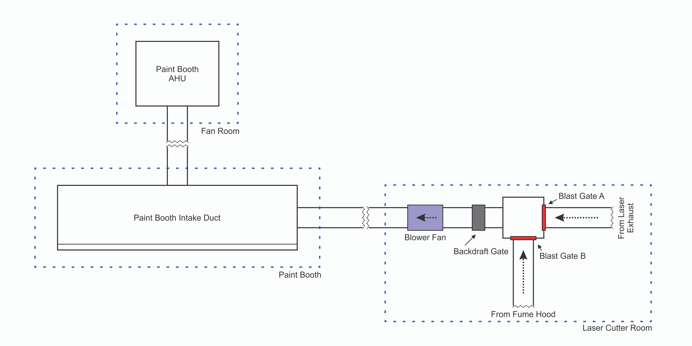

# Laser Cutter Infrastructure Controls System
Relay-logic-based controls system to manage water-cooling, fume ventilation, and other auxiliary functions for the laser cutter &amp; digital fabrication space at the Walker Art Center.

## Control Flow

    

### Overview:
* **Water Cooling Pump** controlled with **Laser Power Button**, ensuring **Water Cooling Pump** is always engaged during **Laser** operation. 
* The **Paint Booth Air Handling Unit (AHU)** and local **Blower Fan** ensured to be always on while **Laser** or **Fume Hood** in use.
* Power to both a **Utility Outlet** at the fume hood workbench (to restrict access to fume-generating tools, like a soldering iron) and internal **Laser Tube** will be interrupted until correct orientation of **Blast Gates** is met, with **Indicator Lights** providing visual feedback.
* While not explicitly shown in this diagram, during operation of either the **Laser** or **Fume Hood** the switch in the **Paint Booth** is interrupted at the **Paint Booth AHU** motor controller in the **Fan Room** so that it may not be used to turn off **Paint Booth AHU**.

## Air Handling Diagram

    

## Fabrication Files
> 📂 **[acrylic parts](acrylic%20parts)/**
> - 📁 [`source`](acrylic%20parts/source)/ — *Editable Corel Draw design files*
>   - 🗒️ [`indicator-light-enclosure-WAC.cdr`](acrylic%20parts/source/indicator-light-enclosure-WAC.cdr)
>   - 🗒️ [`relay-controller-main-enclosure-WAC.cdr`](acrylic%20parts/source/relay-controller-main-enclosure-WAC.cdr)
>   - 🗒️ [`relay-controller-water-cooler-enclosure.cdr`](acrylic%20parts/source/relay-controller-main-enclosure-WAC.cdr)
> - 🗒️ [`indicator-light-enclosure-WAC.dxf`](acrylic%20parts/indicator-light-enclosure-WAC.dxf) — *Enclosure for red/green blast gate satus indicator lights*
> - 🗒️ [`relay-controller-main-enclosure-WAC.dxf`](acrylic%20parts/relay-controller-main-enclosure-WAC.dxf) — *Enclosure for primary relay logic module*
> - 🗒️ [`relay-controller-water-cooler-enclosure-WAC.dxf`](acrylic%20parts/relay-controller-water-cooler-enclosure-WAC.dxf) — *Enclosure for water cooler activation relay*

## Parts List
### Indicator Light Module (per enclosure)
_Requires 1x [`indicator-light-enclosure-WAC.dxf`](acrylic%20parts/indicator-light-enclosure-WAC.dxf)_
| qty | name | source |
| ------------: | :-----------: | :-----------: |
| 10 | M3 nuts | [McMaster](https://www.mcmaster.com/90710A030/) |
| 8 | M3 x 16mm Button Head Machine Screw | [McMaster](https://www.mcmaster.com/92095A184/) |
| 2 | M3 x 35mm Button Head Machine Screw | [McMaster](https://www.mcmaster.com/92095A201/) |
| 2 | Nylon Standoff | [McMaster](https://www.mcmaster.com/90176A166/) |
| 2 |  3/16 x 1-3/4 concrete screw | [McMaster](https://www.mcmaster.com/90161A725/) |
| 1 |  RJ45 Socket Breakout | [Amazon](https://a.co/d/0dmWGGhN) |
| 1 |  Red & Green Indicator Light Pair | [Amazon](https://a.co/d/08HnO1Rn) |
| As Needed | Misc Hookup Wire | [Amazon](https://a.co/d/0hACIMdw) |

### Main Control Module
_Requires 1x [`relay-controller-main-enclosure-WAC.dxf`](acrylic%20parts/relay-controller-main-enclosure-WAC.dxf)_
| qty | name | source |
| ------------: | :-----------: | :-----------: |
| 24 | M3 nuts | [McMaster](https://www.mcmaster.com/90710A030/) |
| 20 | M3 x 16mm Button Head Machine Screw | [McMaster](https://www.mcmaster.com/92095A184/) |
| 4 | Nylon Standoff | [McMaster](https://www.mcmaster.com/90176A166/) |
| 4 |  3/16 x 1-3/4 concrete screw | [McMaster](https://www.mcmaster.com/90161A725/) |
| 4 |  1/2NPT Cable Grip | [Mouser](https://mou.sr/3KeBc74) |
| 4 |  1/2NPT Cable Grip Nut | [Mouser](https://mou.sr/3WWg4U7) |
| 2 | Murrelektronik interface relay | [Automation Direct](https://www.automationdirect.com/adc/shopping/catalog/relays_-z-_timers/electro-mechanical_relays/52102) |
| 5 | 781-1C-24D Ice Cube Relay | [Automation Direct](https://www.automationdirect.com/adc/shopping/catalog/relays_-z-_timers/electro-mechanical_relays/781-1c-24d) |
| 5 | 781 Series Mounting Socket | [Automation Direct](https://www.automationdirect.com/adc/shopping/catalog/relays_-z-_timers/relay_-a-_timer_sockets/781-1c-skt) |
| 3 | 275mm DIN Rail | [Automation Direct](https://www.automationdirect.com/adc/shopping/catalog/wire_-a-_cable_management/din_rail/din_rail/dn-r35s-275-4) |
| 2 |  Solid State Relay | [Amazon](https://a.co/d/05lO5lyu) |
| 2 |  Aluminum SSR Heatsink | [Amazon](https://a.co/d/04LpVrm3) |
| 1 |  24v PSU (120w) | [Amazon](https://a.co/d/0cFTalkx) |
| 2 |  RJ45 Socket Breakout | [Amazon](https://a.co/d/0dmWGGhN) |
| 2 |  Lighted Edison Plug Set | [Amazon](https://a.co/d/048plgdh) |
| As Needed | Misc. Hookup Wire | [Amazon](https://a.co/d/0hACIMdw) |
| As Needed | Misc. Fork Connectors | [Amazon](https://a.co/d/01KCsaIr) |
| As Needed | Misc. Wago Connectors | [Amazon](https://a.co/d/03hsfrAt) |

### Water Cooler Control Module
_Requires 1x [`relay-controller-water-cooler-enclosure-WAC.dxf`](acrylic%20parts/relay-controller-water-cooler-enclosure-WAC.dxf)_
| qty | name | source |
| ------------: | :-----------: | :-----------: |
| 10 | M3 nuts | [McMaster](https://www.mcmaster.com/90710A030/) |
| 10 | M3 x 16mm Button Head Machine Screw | [McMaster](https://www.mcmaster.com/92095A184/) |
| 3 | Nylon Standoff | [McMaster](https://www.mcmaster.com/90176A166/) |
| 3 |  3/16 x 1-3/4 concrete screw | [McMaster](https://www.mcmaster.com/90161A725/) |
| 3 |  1/2NPT Cable Grip | [Mouser](https://mou.sr/3KeBc74) |
| 3 |  1/2NPT Cable Grip Nut | [Mouser](https://mou.sr/3WWg4U7) |
| 1 |  Solid State Relay | [Amazon](https://a.co/d/05lO5lyu) |
| 1 |  Aluminum SSR Heatsink (Large) | [Amazon](https://a.co/d/043KxMh4) |
| 2 |  Lighted Edison Plug Set | [Amazon](https://a.co/d/048plgdh) |
| As Needed | Misc. Hookup Wire | [Amazon](https://a.co/d/0hACIMdw) |
| As Needed | Misc. Fork Connectors | [Amazon](https://a.co/d/01KCsaIr) |
| As Needed | Misc. Wago Connectors | [Amazon](https://a.co/d/03hsfrAt) |
