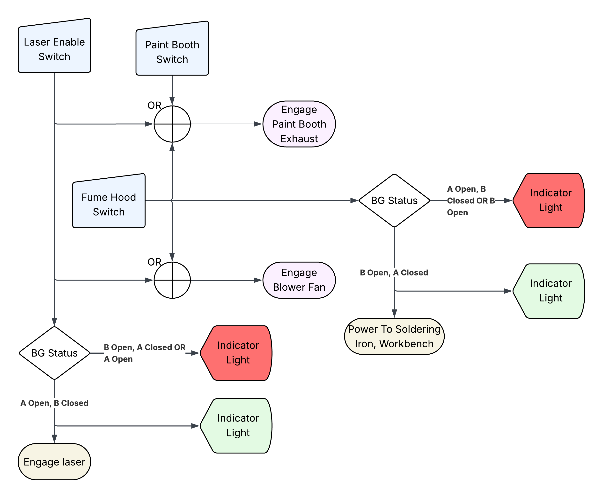

# Laser Cutter Infrastructure Controls System
Relay-logic based controls system to manage water-cooling, fume ventilation, and other auxiliary functions for the laser cutter &amp; digital fabrication space at the Walker Art Center.

## Control Flow

  

### Overview:
* **Water Cooling Pump** controlled with **Laser Power Button**, ensuring **Water Cooling Pump** is always engaged during **Laser** operation. 
* The **Paint Booth Air Handling Unit (AHU)** and local **Blower Fan** ensured to be always on while **Laser** or **Fume Hood** in use.
* Power to both a **Utility Outlet** at the fume hood workbench (to restrict access to fume-generating tools, like a soldering iron) and internal **Laser Tube** will be interrupted until correct orientation of **Blast Gates** is met, with **Indicator Lights** providing visual feedback.
* While not explicitly shown in this diagram, during operation of either the **Laser** or **Fume Hood** the switch in the **Paint Booth** is interrupted at the **Paint Booth AHU** motor controller in the **Fan Room** so that it may not be used to turn off **Paint Booth AHU**.

## Air Handling Diagram

## Fabrication Files
> 📂 **[acrylic parts](acrylic%20parts)/**
> - 📁 [`source`](acrylic%20parts/source)/ — *Editable Corel Draw design files*
>   - 🗒️ [`indicator-light-enclosure-WAC.cdr`](acrylic%20parts/source/indicator-light-enclosure-WAC.cdr)
>   - 🗒️ [`relay-controller-main-enclosure-WAC.cdr`](acrylic%20parts/source/relay-controller-main-enclosure-WAC.cdr)
>   - 🗒️ [`relay-controller-water-cooler-enclosure.cdr`](acrylic%20parts/source/relay-controller-main-enclosure-WAC.cdr)
> - 🗒️ [`indicator-light-enclosure-WAC.dxf`](acrylic%20parts/indicator-light-enclosure-WAC.dxf) — *Enclosre for red/green blast gate satus indicator lights*
> - 🗒️ [`relay-controller-main-enclosure-WAC.dxf`](acrylic%20parts/relay-controller-main-enclosure-WAC.dxf) — *Enclosure for primary relay logic module*
> - 🗒️ [`relay-controller-water-cooler-enclosure-WAC.dxf`](acrylic%20parts/relay-controller-water-cooler-enclosure-WAC.dxf) — *Enclosure for water cooler activation relay*
